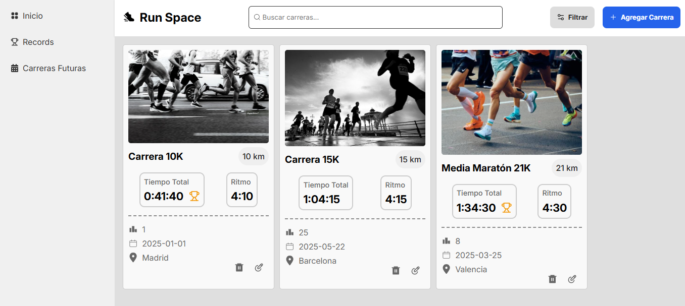

# 🏃🏻 Run Space

**Run Space** es una aplicación web desarrollada con **React** que permite a corredores registrar y visualizar sus carreras de forma estética y organizada.  
Más que un simple registro de tiempos y distancias, busca ser un espacio personal donde cada corredor pueda revivir y dar valor a sus experiencias deportivas.

---

## ✨ Motivación

El proyecto nació de mi propia experiencia como corredor.  
Después de cada competencia suelo escribir en un diario mis sensaciones, aprendizajes y emociones.  

Esa práctica me ayudó a comprender que las carreras no se reducen a números: también son recuerdos, historias y logros personales.  

**Run Space** busca trasladar esa costumbre al mundo digital, creando una herramienta práctica y visualmente atractiva para almacenar no solo resultados, sino también momentos significativos.

---

## ⚙️ Tecnologías utilizadas

- [React](https://react.dev/) – Librería principal para la construcción de la interfaz  
- [React Router](https://reactrouter.com/) – Manejo de rutas y navegación  
- [Radix UI](https://www.radix-ui.com/) – Componentes accesibles y modales  

---

## 🚀 Características

- 📌 Registro de nuevas carreras con detalles como título, distancia, tiempo, ritmo, posición, fecha y ubicación  
- 🏅 Posibilidad de marcar carreras como **récord personal (PR)**  
- 🖼️ Soporte para imágenes de cada carrera  
- 📊 Visualización de carreras en forma de **cards**  
- 🔍 Filtrado automático de récords en la sección **Records**  

---

## 📷 Vista previa



---

## 🔧 Instalación y uso

```bash
# Clonar el repositorio
git clone https://github.com/juanbautistamalina/run-space
cd run-space

# Instalar dependencias
npm install

# Iniciar el servidor de desarrollo
npm run dev

# Abrir en el navegador
http://localhost:5173
```

---

## 🗺️ Roadmap

<!-- - ✅ Persistencia de datos con **localStorage** o integración con **Firebase/Supabase**   -->
- 📊 Estadísticas globales (distancia total, mejores tiempos, promedios)  
- 📝 Sección de diario para registrar experiencias post-carrera  

---

## 👤 Autor

Desarrollado por **Juan Bautista Malina**

- 🌐 [Portfolio](https://juanbautistamalina.github.io/portfolio/)  
- 💻 [GitHub](https://github.com/juanbautistamalina)  
- 💼 [LinkedIn](https://www.linkedin.com/in/juan-bautista-malina)  
